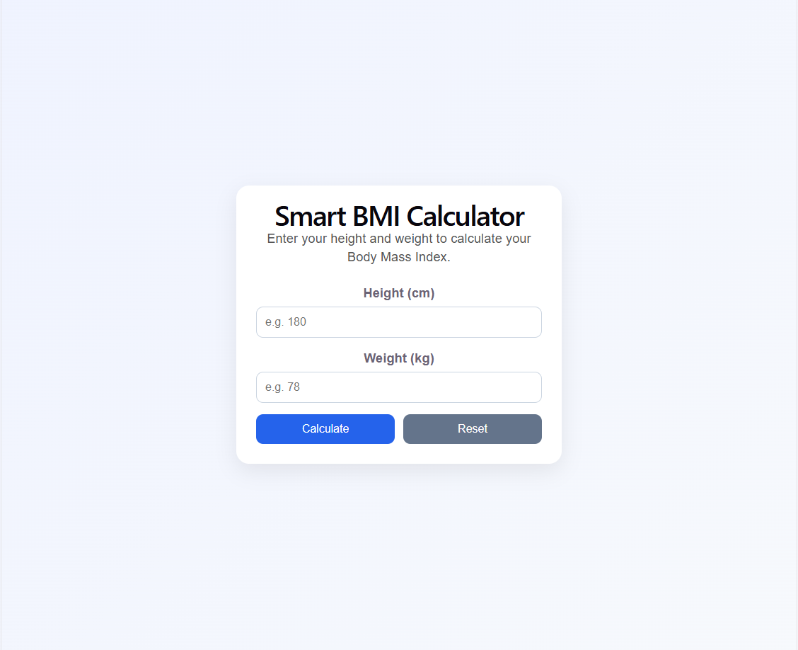

# React + Vite

## Smart BMI Calculator

A simple front-end web application that calculates Body Mass Index (BMI).
The app allows users to enter their height and weight, calculates the BMI value, displays the BMI category, and provides a short health tip based on the result.

This project was created with the help of AI tools as part of the HAMK AI course assignment.

Live Demo
You can test the application here:

https://hamk-ai-bmi-calculator-2026.vercel.app/

###Features

Calculate BMI (Body Mass Index)

Show BMI result with two decimal precision

Display BMI health category

Underweight

Normal weight

Overweight

Obesity

Provide a short health tip

Save the latest result using localStorage

Automatically load saved values when reopening the app

Reset button to clear inputs

Responsive design for desktop and mobile

### Technologies Used

React

Vite

JavaScript

CSS

Vercel (deployment)

AI-assisted development

### AI Usage

AI tools were used to assist in:

generating the project idea

creating the React application structure

improving the UI layout

assisting with JavaScript logic

debugging and refining the code

### Example prompt used with AI:

Create a modern front-end web app called "Smart BMI Calculator".

Requirements:
- Use React
- Responsive modern UI
- Input fields for height in cm and weight in kg
- Button to calculate BMI
- Show BMI result with 2 decimals
- Show BMI category
- Provide a short health tip based on the result
- Save the latest values using localStorage
- Add a reset button
- Use a clean card-based layout

### Installation

Clone the repository: git clone https://github.com/Popeye822/Hamk-AI-App-React-Vite-BMI-Calculator.git

### Go to the project folder:
Go to the project folder: cd YOUR_REPOSITORY_NAME

npm install

npm run server

http://localhost:5173

### Deployment

The application is deployed using Vercel.

Steps used:

Push project to GitHub

Import repository into Vercel

Deploy automatically

Every push to the main branch automatically updates the deployed application.

### Project Purpose

The purpose of this project was to:

practice AI-assisted development

create a front-end web application

deploy the application online

provide a public URL for testing

This was part of the HAMK AI course assignment.

### Author

Kalle Sepponen

HAMK – AI Course Project